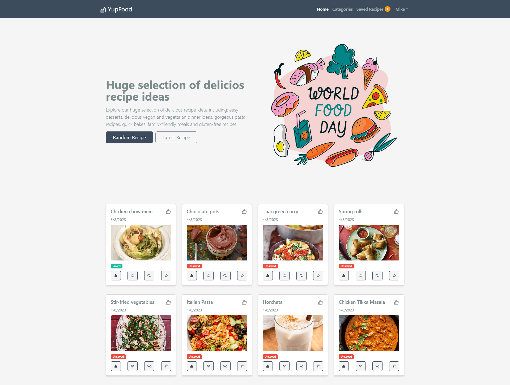
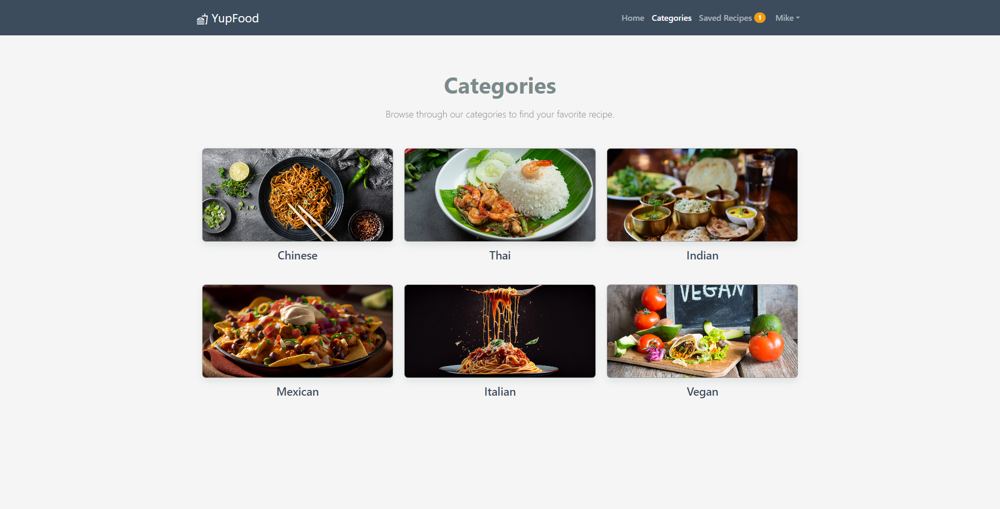
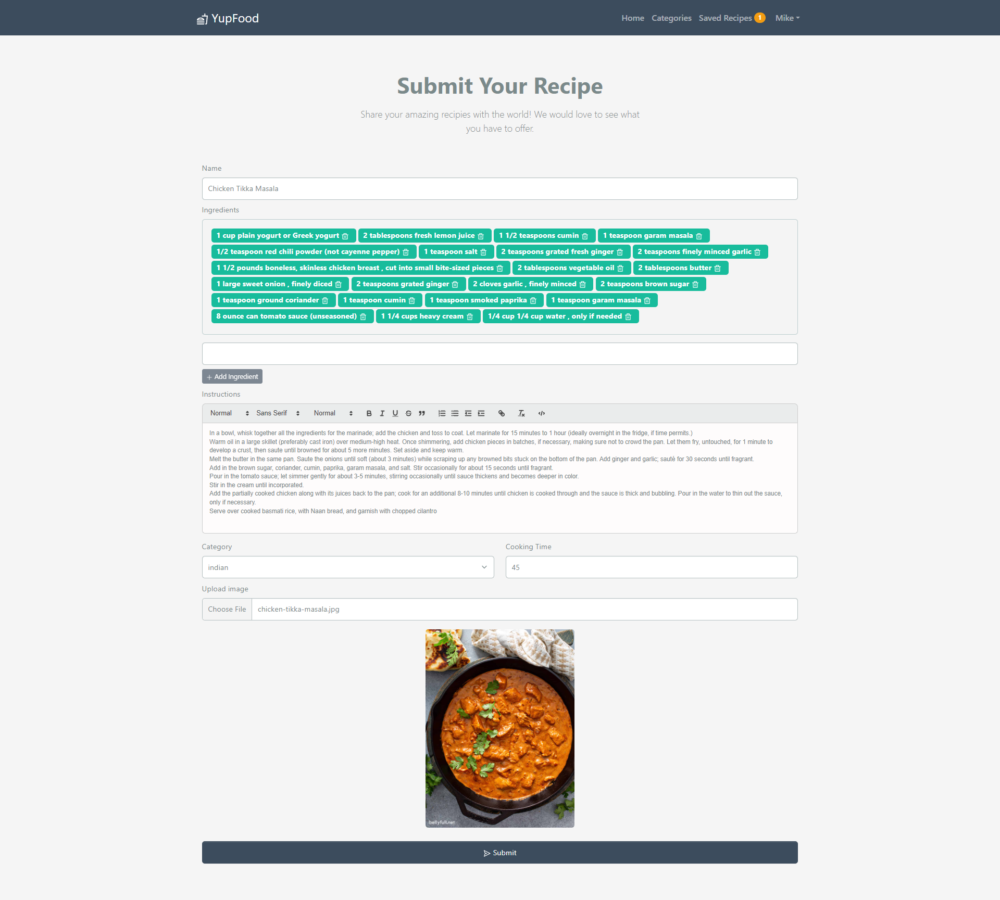

# YupFood Food Blog Platform

> Food blog platform built with the MERN stack & Redux.





## Features

- Add - Update - Delete recipe
- Like & Unlike recipe
- Save & Unsave recipe
- Latest recipe
- Random recipe
- User profile with details
- Guest profile with details
- Add review & comment
- Check the recipe view (how many users have seen the recipe)
- Admin recipes management
- Admin user management
- Admin categories
- Make other user an admin
- Image uploaded to the cloud

## Upcomming Features

- Recipe pagination
- Recipe search feature

## Usage

- Create a MongoDB database and obtain your `MongoDB URI` - [MongoDB Atlas](https://www.mongodb.com/cloud/atlas/register)

### Env Variables

Rename the `.env.example` file to `.env` and add the following

```
NODE_ENV = development
PORT = 5000
MONGO_URI = your mongodb uri
JWT_SECRET = your secret
PRESET_NAME = your preset name
CLOUD_NAME = your cloud name in cloudinary
API_SECRET = your api secret
API_KEY = your api key
```

### Install Dependencies (frontend & backend)

```
yarn
cd frontend
yarn
```

### Run

```

# Run frontend (:3000)
cd frontend
yarn start

 # Run backend (:5000)
yarn run server
```

## Tech

Frontend

- [React]
- [Typescript]

Backend

- [node.js]
- [Express]
- [mongodb]
- [Typescript]

[React]: https://react.dev/
[Redux]: https://redux.js.org/tutorials/typescript-quick-start/
[Typescript]: https://www.typescriptlang.org/
[node.js]: http://nodejs.org
[express]: http://expressjs.com
[mongodb]: https://www.mongodb.com//
 